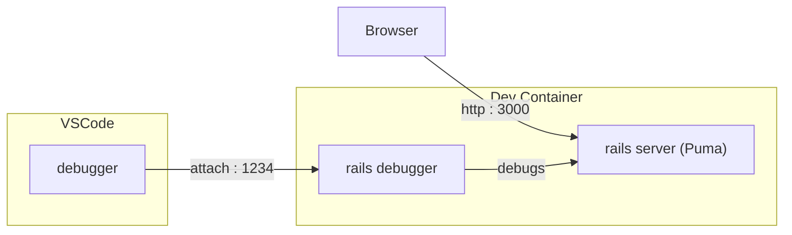

# PoC Dev container Rails app

Develop and debug Rails app using Docker container.

## How it works

- Rails app and debugger runs inside Docker container
- VSCode debugs into it with remote debugging
- Rails app access via HTTP

## Why?

- Setup development environment quickly and consistently - minimal setup on host
- Ensure dev environment closely match production (same / almost same image)

## Rails Versions in Demo

Each version of rails has its own way of doing this.

Please see individual READMEs to get going:

- [Rails 6](rails_6/Readme.md)
- [Rails 7](rails_6/Readme.md)
