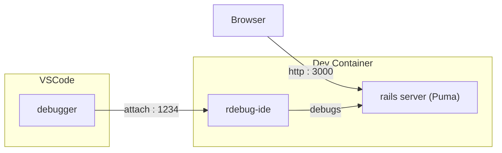

# PoC Dev container Rails app

Develop and debug Rails app using Docker container.

## How it works



- Rails app and debugger runs inside Docker container
- VSCode debugs into it with remote debugging
- Rails app access via HTTP

## Why?

- Setup development environment quickly and consistently - minimal setup on host
- Ensure dev environment closely match production (same / almost same image)


## Running and debugging with VSCode

1. Start-up dev container (may take a while to build on first run)

    ```shell
    ./debug-app.sh
    ```

2. Press F5 to attach VSCode debugger to dev container
3. Add a breakpoint (e.g. to [debugtest_controller.rb](src/blog/app/controllers/debugtest_controller.rb) line 5)
4. Debug away 🙂 (e.g. go to http://localhost:3000/debugtest)


## Get shell into container

To get a shell into container (e.g. to run `irb` / `rails console`):

```shell
./bash-shell-rails_debug.sh
```

Then run whatever command you want.

Tip: For advanced needs, use `docker exec` - see [bash-shell-rails_debug.sh](bash-shell-rails_debug.sh) for example.


## Clean-up

To stop and remove container:

```shell
./clean-up-debug-rails.sh
```


## Optional VSCode setups

To get things like code completion, navigation ("intellisense") for VSCode, install these on host:

```shell
# Install ruby language support
vscode --install-extension rebornix.Ruby

# Enable code completion, navigation ("intellisense")
sudo gem install solargraph
vscode --install-extension castwide.solargraph
```
